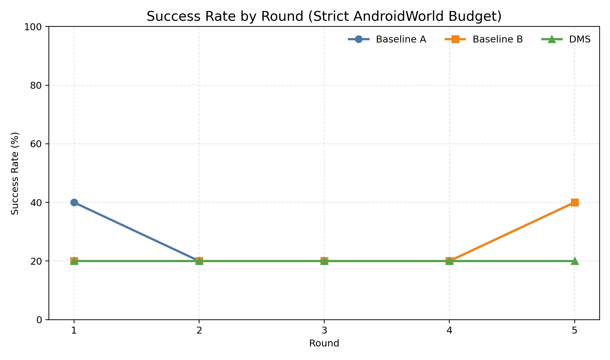
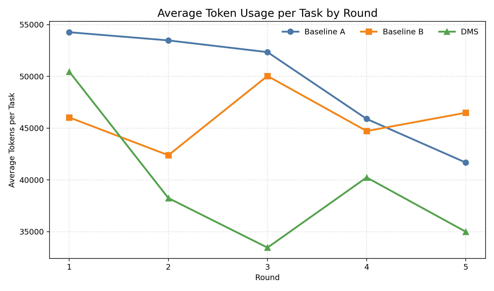
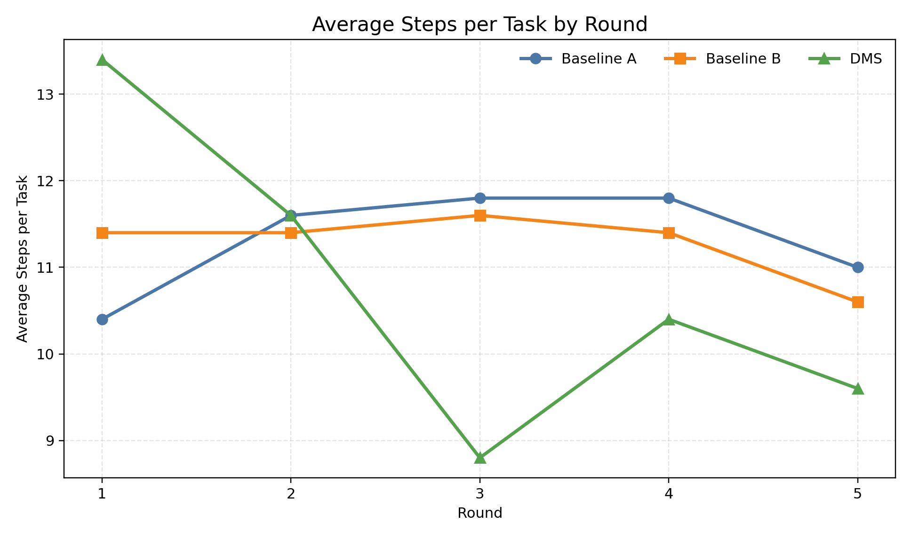
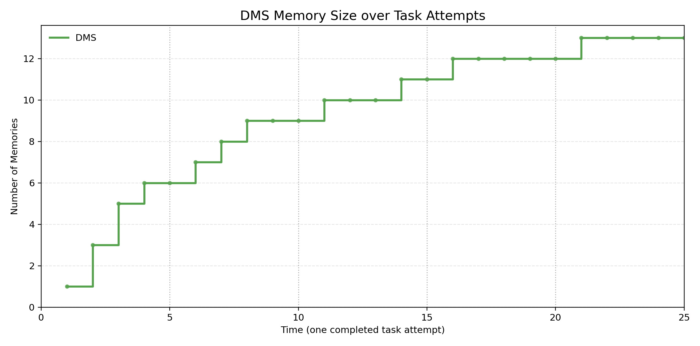
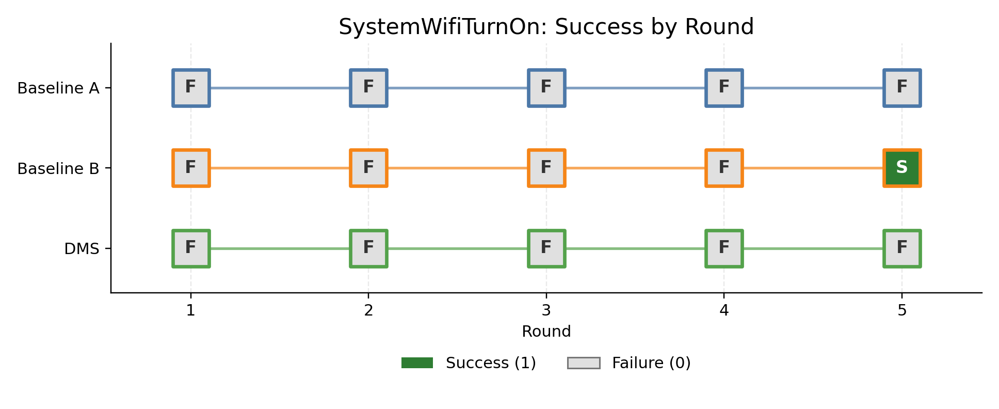
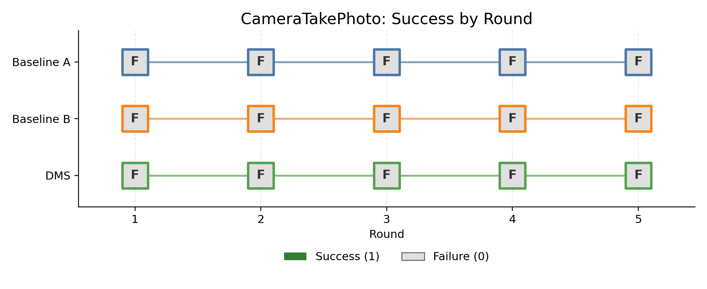
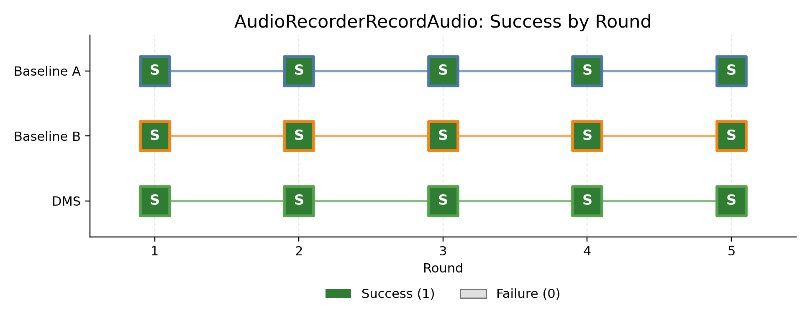
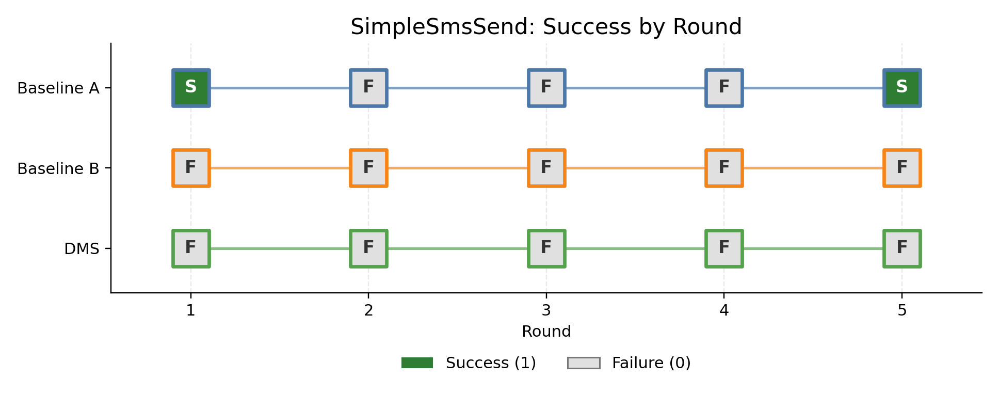
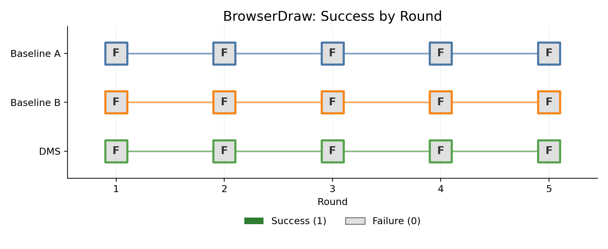

# Darwinian Memory System 复现实验

## 1. 项目介绍

本项目复现 Darwinian Memory System（DMS），并在 AndroidWorld GUI 任务上比较三种方法：

无记忆的 Baseline A、静态历史记忆的 Baseline B，以及能够检索、反馈调节和动态剪枝的DMS。

实验重点是观察记忆机制能否在多轮任务中提高成功率，同时降低无效动作、Token 消耗和重复失败。

当前正式实验采用 5 个固定任务、5 轮、3 种方法，共 75 次计分运行。

## 2. 仓库结构

```text
DMS/
├── configs/                  # 三种方法、模型与运行环境配置
├── datasets/                 # AndroidWorld 测试集与正式五任务清单
├── device_images/            # 标准镜像和官方应用快照
├── docs/                     # 机制对应与环境说明
├── fig/                      # 正式实验图表、汇总与逐任务结果
├── protocols/                # 正式实验冻结协议与 SHA256
├── runs/                     # 预检、正式结果、轨迹与审计日志
├── scripts/                  # 环境准备、自动运行和结果分析脚本
├── src/
│   ├── dms/            # PA-Lite、静态记忆、DMS 与 Runner
│   ├── env/                  # AndroidWorld 观测适配
│   └── model_client/         # Qwen2.5-VL 推理客户端
├── tests/                    # 单元与集成测试
└── third_party/android_world/# AndroidWorld 运行时源码
```

## 3. 实验环境

本地端：

- Windows 10 Pro 64-bit
- AMD Ryzen 5 7500F，6 核 12 线程
- 约 31.7 GiB RAM
- Pixel 6 / Android API 33 / x86_64 模拟器
- AVD：`AndroidWorldAvd`
- ADB：`emulator-5554`
- gRPC：8554
- UIAutomator + screenshot

远程推理端：

- Ubuntu 22.04.1 LTS
- NVIDIA RTX 4090，24564 MiB
- vLLM 0.10.2
- Qwen/Qwen2.5-VL-7B-Instruct，bfloat16
- `max_model_len=32768`，`max_num_seqs=1`
- `gpu_memory_utilization=0.92`

Android 模拟器运行在本地，截图和 UI tree 经 Windows 客户端发送到远程模型；模型返回动作
后，再由本地 ADB 执行。每种方法的每一轮都从同一镜像恢复(出厂状态+AndroidWorld官方初始化)，
跨轮只保留该方法应有的主机侧记忆。

## 4. 一键运行五任务实验

完成模拟器、SSH 隧道和模型服务准备后，在项目根目录运行：

```powershell
powershell -ExecutionPolicy Bypass -File scripts/run_formal_device_separated_windows.ps1
```

脚本会依次运行 Baseline A、Baseline B 和 DMS。每种方法每轮执行同一组 5 个任务，并在
控制台与 `runs/formal_mini_5tasks_balanced_v1_20260719/` 下持续写入执行日志、单任务结果、
重试审计和运行状态。正式配置见
[`configs/eval_baselines_mini_optimized.yaml`](configs/eval_baselines_mini_optimized.yaml)，
任务清单见
[`datasets/formal_mini_5tasks_balanced_v1.yaml`](datasets/formal_mini_5tasks_balanced_v1.yaml)。

## 5. 三种对比方法

| 方法 | 机制 | 主要文件 |
| --- | --- | --- |
| Baseline A | PA-Lite Planner-Actor；每个任务零记忆启动 | [`src/dms/agent.py`](src/dms/agent.py)、[`src/dms/prompts.py`](src/dms/prompts.py) |
| Baseline B | 在 PA-Lite 上追加跨任务历史；按时间顺序注入，不检索、不剪枝 | [`src/dms/static_memory.py`](src/dms/static_memory.py)、[`src/dms/runner.py`](src/dms/runner.py) |
| DMS | 分层记忆、双因子检索、风险反馈、变异替换和动态剪枝 | [`src/dms/darwinian_memory.py`](src/dms/darwinian_memory.py)、[`src/dms/agent.py`](src/dms/agent.py) |

三种方法共用同一 AndroidWorld evaluator、任务预算、模型和 Prompt。正式运行与基础设施重试由[`src/dms/formal_runner.py`](src/dms/formal_runner.py) 负责；只有实际传给
`env.execute_action` 的 GUI 动作消耗官方 action budget，Planner、`complete`、`remember`
和解析失败单独计入有上限的 control turns。

## 6. 实验结果

### 6.1 20任务实验及放弃原因

我们先后进行了两次 20-task 大规模实验，但都没有形成可用于三方法结论的完整对比。

- 第一次：Baseline A 完成 100 次，成功 3 次、基础设施失败 22 次；Baseline B 完成
  100 次，成功 2 次、基础设施失败 67 次；DMS 未完成。
- 第二次：Baseline A 完成 64 次，成功 3 次、正常模型失败 58 次、基础设施失败 3 次；
  Baseline B 和 DMS 尚未开始时终止。该运行已标记为不可恢复。

第二次实验 64 次运行约耗时 2.57 小时，折合约 24.9 次/小时。300 次实验仅按这一速度就需约 12 小时，DMS 记忆操作、每轮设备恢复和基础设施重试还会继续增加时间。

实验同时依赖本地模拟器、SSH 隧道、远程 GPU、vLLM 和长时间网络连接；实际运行中出现过 SSH 隧道上的keep-alive 连接失效、ADB/evaluator 异常和会话中断。

我目前在上海，近两天受到台风影响，网络和供电也引起了一次实验中断，最终由于时间原因，我放弃了20任务的实验.

前期实验暴露出三个最重要的问题：

1. **虚假完成与重复循环:** LLM认为任务完成后，就会输出compete指令，但是LLM经常误判任务是否完成，比如在`CameraTakePhoto` 任务中，模型没有完成拍照，却连续输出`complete(success=True, reason="Photo taken successfully")`。`complete` 不改变设备状态，evaluator 始终为 0，最终耗尽 10-step 预算。根因是模型混淆了“打算执行”“已经执行”和“环境确认完成”，控制器也缺少状态变化检测。
2. **权限弹窗与 open-app shortcut 冲突:** 大部分任务的第一步是打开某一个应用，为了优化这一部分的成功率，特别是降低格式问题带来的错误，一旦MLLM的返回中包含某个应用名，我们就自动匹配正确的格式打开该应用，但是，当启动后若出现系统权限申请弹窗(PermissionController)，会因前台包名不是 Contacts 而重复`start_app("contacts")`，既无法关闭弹窗又持续消耗预算。当前实现在系统弹窗覆盖目标App 时暂停 shortcut，把控制权交给 Actor；标准镜像只统一处理非任务相关的常规权限和onboarding，不加入任务专用点击脚本。但是弹窗问题依然会很大程度上消耗步数，影响成功率。
3. **提示词过强(关键词分类)破坏动作语义**: 在过去的提示词优化中，我们加入了关键词分类这种提示词，一旦遇到某种提示词就会将任务划分为特定的一类，一旦误判，就会出现问题。比如 `BrowserDraw` 的目标含有 “when prompted”，旧代码因为匹配宽泛关键词 `"when "`，把 GUI 任务误判为问答任务，将 `complete` 转换为
   `answer("chrome is already open")`，随后在 Chrome 首次启动页反复 `answer`，直至耗尽20-step 预算。可靠修复应由 Planner 输出 `gui_action`、`information_query`、`navigation` 等结构化类型，只有明确的信息查询才允许 `answer`，并依据当前 subtask校验动作。该结构化分类尚未进入本次已冻结的 75 次实验，因此作为已知限制和后续修复，
   不冒充已实现优化。

这些现象说明低成功率不仅来自 7B 模型较弱，也来自完成验证、系统中断建模和动作语义约束不足。网络、SSH 隧道、ADB 和 evaluator 中断则单独作为基础设施有效性威胁统计，不与
正常模型失败混为一类。因此两次大实验只用于诊断，不作为最终结果。

### 6.2 平衡五任务实验

正式小规模实验固定选择：

| 难度 | 任务 | Seed | Action budget |
| --- | --- | ---: | ---: |
| Easy | `SystemWifiTurnOn` | 1047 | 10 |
| Easy | `CameraTakePhoto` | 1032 | 10 |
| Medium | `AudioRecorderRecordAudio` | 1030 | 12 |
| Medium | `SimpleSmsSend` | 1046 | 12 |
| Hard | `BrowserDraw` | 1033 | 20 |

任务选择受到前期诊断结果启发，因此结论仅适用于这个 mini benchmark。正式运行开始后不更换任务、seed 或顺序，也不通过额外重试追求成功。

<!-- MAIN_EXPERIMENT_RESULTS_START -->
## 平衡 Mini Benchmark 结果（5 Tasks × 5 Rounds）

本节数据来自本机 AndroidWorld 模拟器与 AutoDL Qwen2.5-VL-7B-Instruct
远程推理实验。每种方法运行 5 个固定任务，共 5 轮、25 次
任务尝试；三种方法合计 75 次。成功率采用严格口径：AndroidWorld 判定成功且
最终计分尝试的动作数严格小于该任务的官方 `int(10 × complexity)` 预算。

| Method | Strict Successes | Success Rate | Avg Tokens/Task | Avg Steps/Task | Infra Retries | Infra Failure After Retry | Final Memory Size |
| --- | ---: | ---: | ---: | ---: | ---: | ---: | ---: |
| Baseline A | 7/25 | 28.00% | 49526.0 | 11.32 | 0 | 0 | 0 |
| Baseline B | 6/25 | 24.00% | 45929.2 | 11.28 | 0 | 0 | 25 |
| DMS | 5/25 | 20.00% | 39473.8 | 10.76 | 2 | 1 | 13 |

从严格成功率看，DMS 的 20% 低于 Baseline A 的 28% 和 Baseline B 的 24%，因此本次 mini benchmark 没有直接验证 DMS 能提高任务成功率，但是由于任务的成功带有随机性，我们选择的样本较小，所以这也是可能的。DMS 的优势体现在效率：平均 Token 用量比 Baseline A 低 20.3%、比 Baseline B 低 14.1%，平均动作数分别低 4.9% 和 4.6%；25 次任务后仅保留 13 条记忆，而静态记忆保留 25 条。结果支持动态剪枝和上下文压缩机制有效。

Token 和 Step 均累计首次异常尝试与最终计分尝试的消耗。逐轮数值、原始 CSV 和严格统计定义见 [`fig/summary.md`](fig/summary.md)。

### 1. 三种算法的成功率随轮数变化



### 2. 三种算法的平均单任务 Token 用量随轮数变化



### 3. 三种算法的平均单任务 Step 数随轮数变化



### 4. DMS 记忆库大小随任务时间变化

横轴中的一个时间单位对应一个已经完成的任务尝试；每 5 个时间单位为一轮。



### 5. 五个单独任务的逐轮成功/失败（三种算法）







<!-- MAIN_EXPERIMENT_RESULTS_END -->

## 7. Gap 分析：7B 与论文 72B

论文实验使用的 72B 视觉语言模型在长程规划、细粒度定位、结构化动作生成和错误恢复上明显强于本复现的 7B 模型。我们观察到的差异包括：7B 更容易在相同画面重复 `complete`、输出不完整工具调用、误点相邻控件，并在权限页或首次启动页陷入循环；低 complexity 也不等于对 7B 简单，因为视觉定位、文本理解和恢复成本没有被该指标完整表示。

为缩小差距，本实验采用通用而非任务专用的工程调整：

- Prompt 要求先处理可见权限弹窗和 onboarding，并只在存在可见状态证据时声明完成；
- 重复且无状态变化的完成声明记为 `unsupported_completion`，下一轮必须改变策略；
- `planner_max_cycles=6`，`control_turn_limit=36`，避免无限免费推理；
- 模型输出上限由 192 提高到 320 tokens，降低 CodeAct 截断概率；
- 使用确定性解码、单图输入和简化 UI tree，减少动作格式漂移；
- PermissionController 在前台时，open-app shortcut 让出控制权。

前期实验还表明，后续应以 Planner 的结构化任务类型替代宽泛关键词分类，并按当前 subtask验证 `answer` 等动作。本次正式实验开始前没有可靠完成这项改造，所以它被如实保留为 Gap，不在运行中修改冻结代码。

这里的 Planner 上限 6 是本复现的工程参数，不是论文报告的固定值。所有调整对三种方法一致，不向模型泄露任务答案、evaluator reward 或成功判定逻辑。即使 DMS 在五任务实验中表现更好，结论也只能说明其机制在该 7B mini benchmark 上有效，不能直接等同于 72B 的完整 AndroidWorld 结果。
