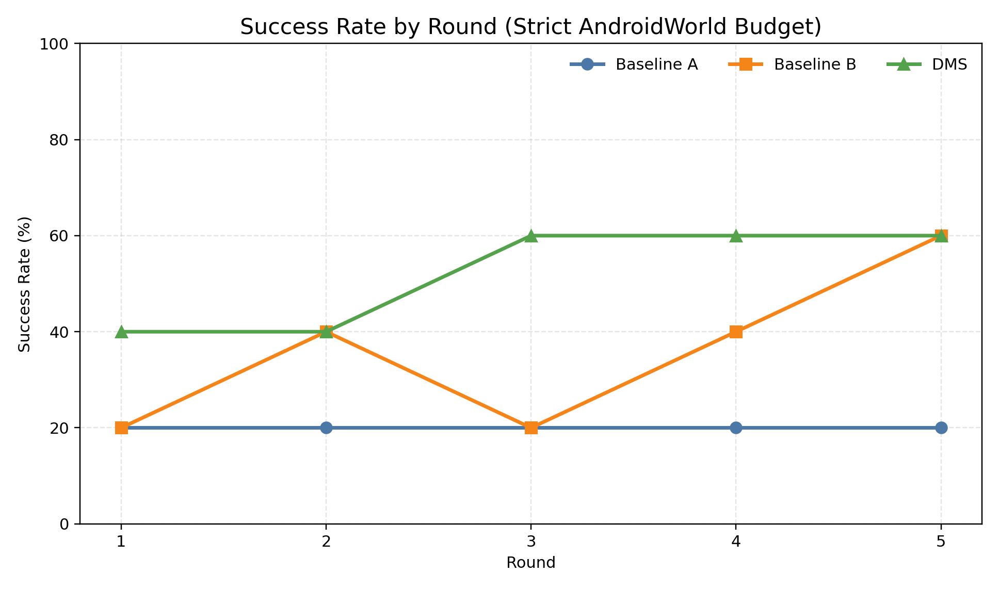
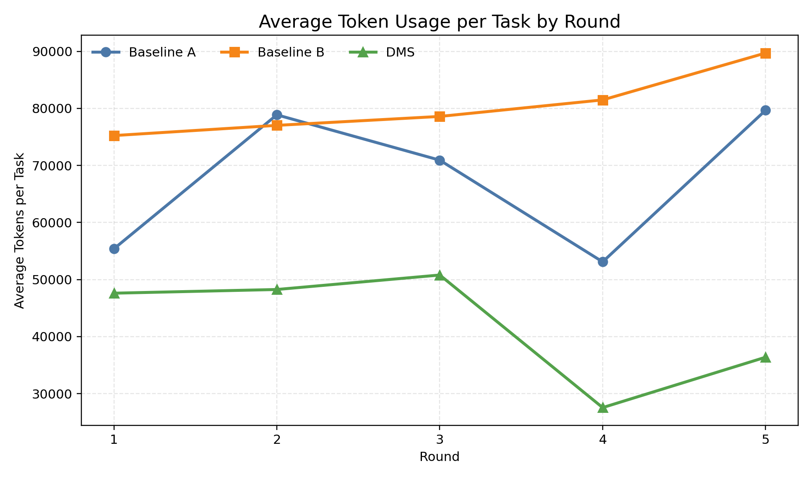
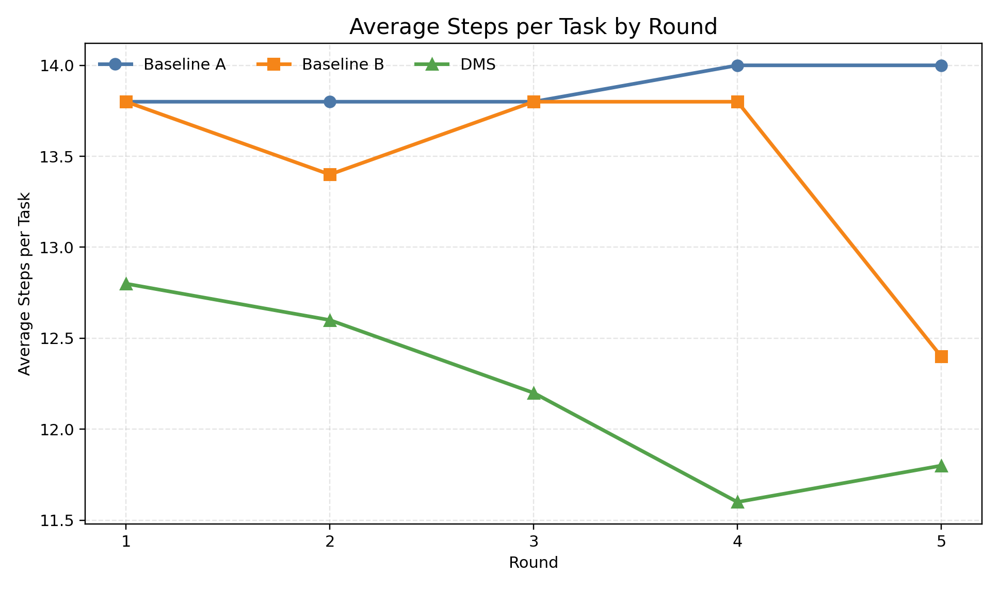
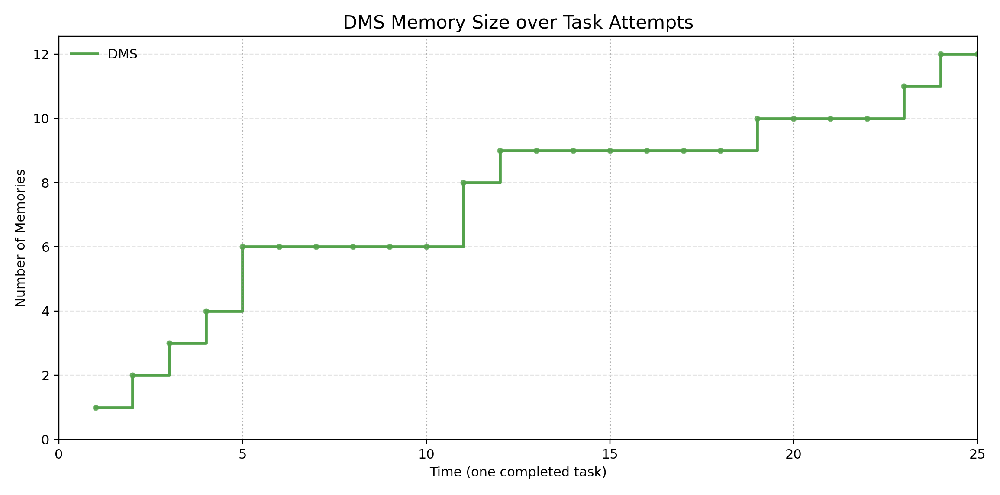
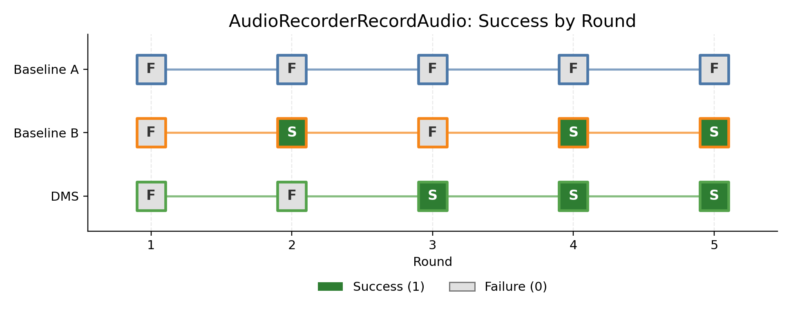
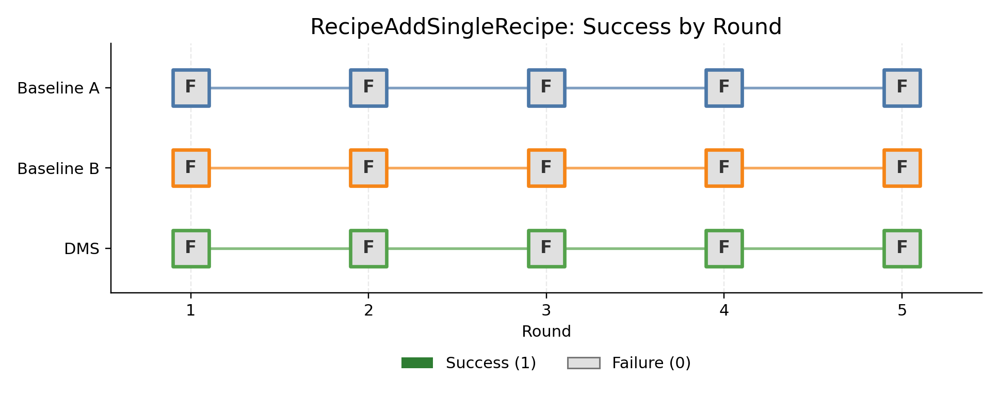
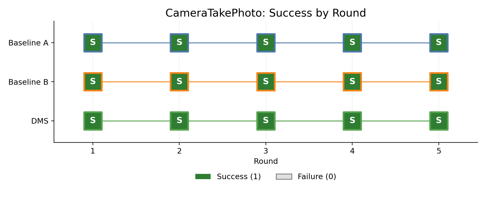
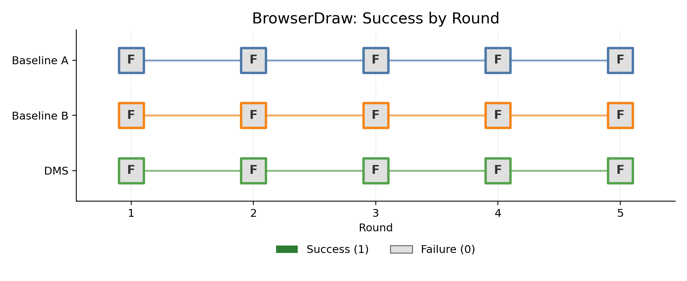
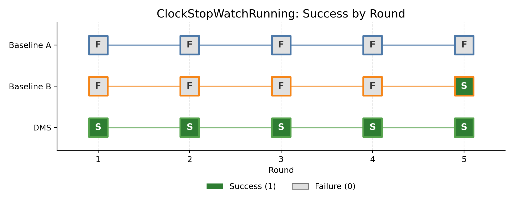

# Darwinian Memory System 复现实验

## 1. 项目介绍

本项目在 AndroidWorld 动态 GUI 环境中复现 Darwinian Memory System（DMS），并统一比较三种方法：

- Baseline A：不使用跨任务记忆的 PA-Lite Planner–Actor。
- Baseline B：按时间顺序追加历史轨迹的静态记忆。
- DMS：支持分层存储、双因子检索、轨迹回放、风险反馈、变异替换和动态剪枝的记忆系统。

三种方法使用相同的 AndroidWorld evaluator、任务顺序、随机种子、动作预算和
Qwen2.5-VL-7B-Instruct 模型。实验重点是观察跨轮记忆能否提高任务成功率，同时降低
单任务 Token 和 Step 用量。

当前已经完成的正式实验采用 5 个固定任务、5 轮、3 种方法，共 75 次计分运行。该运行通过
了 a11y、ADB、forwarder、Chrome native crash 和保存 observation 的基础设施审计。

## 2. 仓库结构

```text
DMS/
├── README.md                 # 项目说明、运行方法、结果和限制
├── pytest.ini                # 默认只收集本项目 tests/，排除 vendored AndroidWorld 测试
├── configs/                  # 三种方法、远程模型与 AndroidWorld 运行配置
├── datasets/                 # AndroidWorld 数据集与正式五任务清单
├── docs/                     # 机制对应、环境和实验协议说明
├── figs/                     # 经过确认的正式图表、CSV 和汇总
├── runs/                     # 每次运行的轨迹、observation、日志和逐任务结果
├── scripts/
│   ├── common/               # 所有脚本共用的环境激活逻辑
│   ├── setup/                # Python、AndroidWorld、模型与运行资源安装
│   ├── run/                  # 单方法、三方法及模拟器启动入口
│   ├── analysis/             # 结果汇总与绘图
│   ├── monitor/              # AndroidWorld、a11y 与模型连通性检查
│   └── data/                 # 数据集生成与校验
├── src/
│   ├── dms/                  # PA-Lite、静态记忆、DMS 与 runner
│   ├── env/                  # a11y、ADB、observation 和环境适配
│   └── model_client/         # 本地及远程 Qwen-VL 客户端
├── third_party/
│   └── android_world/        # 固定版本的上游 AndroidWorld 源码
├── tests/                    # 单元测试与集成测试
└── requirements.txt          # Python 3.10 依赖版本
```

`runs/<run_id>/figs/` 保存某一次实验自动生成的图；仓库根目录的 `figs/` 只保存经过审计、
需要展示或写入报告的正式结果。`runs/`、模型权重、conda 环境、Android SDK、AVD 和日志等
大型运行产物不提交到 Git。

正式 Python 包名为 `dms`，上游 AndroidWorld 独立存放在 `third_party/android_world/`。
目录重构只改变源码组织和启动路径，没有修改算法、Prompt、实验配置或已生成结果。

## 3. 实验环境
(由于AndroidWorld对windows环境的适配不佳，存在大量问题，我将项目整体迁移到了Linux环境)
本地主机与 WSL：

- Windows 10 Pro 64-bit 宿主机。
- WSL2，Ubuntu 24.04.3 LTS。
- Python 3.10.18，项目环境位于 `conda_envs/dms_py310`。
- AMD Ryzen 5 7500F，6 核 12 线程，约 31.7 GiB RAM。
- Pixel 6 / Android API 33 / x86_64 模拟器。
- AVD：`AndroidWorldAvd`。
- ADB device：`emulator-5554`。
- AndroidWorld gRPC：8554。
- 模拟器以 headless 模式运行，启用 `-feature -Vulkan`，并使用 SwiftShader/llvmpipe
  软件图形链路规避 Chrome GPU compositor 的 native crash。
- 主 observation 来源是 accessibility forwarder 与 screenshot；正式运行采用严格 a11y
  协议，实际 UIAutomator 回退或仅包含 SystemUI 的 observation 均视为基础设施污染。

远程推理端：

- Ubuntu 22.04.1 LTS。
- NVIDIA RTX 4090，24564 MiB。
- vLLM 0.10.2。
- `Qwen/Qwen2.5-VL-7B-Instruct`，bfloat16。
- `max_model_len=32768`，`max_num_seqs=1`。
- `gpu_memory_utilization=0.92`。
- OpenAI-compatible API 通过 SSH 本地转发暴露为
  `http://127.0.0.1:8000/v1`。
- `do_sample=false`，单次最大输出 192 tokens。

Android emulator、ADB、accessibility forwarder 和 evaluator 全部由 WSL 工作区控制；截图和
a11y tree 通过本地 SSH 转发发送给远程模型，模型返回结构化动作后再由 WSL 中的 AndroidWorld
执行。远程服务只负责模型推理，不参与 memory 存储或 evaluator 判定。

首次部署可在 WSL 项目根目录执行：

```bash
bash scripts/setup/bootstrap_clone_setup.sh
```

只需激活现有环境时执行：

```bash
source scripts/common/activate_env.sh
```

## 4. 一键运行五任务实验

运行前需要确保：

1. AndroidWorld 模拟器已经启动并完成 boot。
2. accessibility forwarder 正常运行。
3. SSH 隧道已经将远程 vLLM 映射到 WSL 的 `127.0.0.1:8000`。
4. `GET http://127.0.0.1:8000/v1/models` 可以正常返回。

在 WSL 项目根目录执行：

```bash
cd /path/to/DMS
bash scripts/run/run_selected5_all_methods.sh
```

脚本默认使用 `datasets/mini_benchmark_probe5.yaml`，按顺序运行 Baseline A、Baseline B 和
DMS，每种方法执行 1 轮。运行前会验证数据集恰好包含 5 个任务，并检查模型服务、AndroidWorld 和 a11y。

运行正式 5 轮实验：

```bash
bash scripts/run/run_selected5_all_methods.sh --rounds 5
```

指定另一份五任务数据集：

```bash
bash scripts/run/run_selected5_all_methods.sh \
  --rounds 5 \
  --dataset datasets/my_selected_5tasks.yaml
```

只验证输入并打印将要执行的命令，不启动实验：

```bash
bash scripts/run/run_selected5_all_methods.sh --rounds 5 --dry-run
```

每次执行都会创建全新目录：

```text
runs/selected5_3methods_<rounds>rounds_<timestamp>/
├── launcher.stdout.log
├── current_method.txt
├── baseline_a.stdout.log
├── baseline_b.stdout.log
├── dms.stdout.log
├── baseline_a/
├── baseline_b/
└── dms/
```

终端会实时打印每个 step 的动作与结果，以及每个任务的 success、steps、tokens 和
memory size。完整 observation、原始 JSONL、单任务轨迹、metrics 和 memory 审计仍保存在
对应方法目录中。脚本拒绝覆盖或自动接续非空 RunRoot。

## 5. 三种对比方法

| 方法 | 机制 | 主要文件 |
| --- | --- | --- |
| Baseline A | PA-Lite Planner–Actor；每个任务不读取跨任务记忆 | `src/dms/agent.py`、`src/dms/prompts.py` |
| Baseline B | 按时间顺序追加完整历史；不做检索、反馈调节或剪枝 | `src/dms/static_memory.py`、`src/dms/runner.py` |
| DMS | 分层记忆、双因子检索、风险抑制、轨迹回放、变异替换和容量剪枝 | `src/dms/darwinian_memory.py`、`src/dms/agent.py` |

三种方法由同一个 runner 启动，正式入口为 `python -m dms.runner`。DMS memory 使用
`all-MiniLM-L6-v2` 生成检索 embedding；Qwen2.5-VL-7B-Instruct 负责 Planner 和 Actor
决策。

DMS 当前配置的初始容量为 24，最大容量为 96。动态剪枝只在 active memory 数量达到当前
容量时计算 survival-value elbow；`failure_count` 影响 survival/risk 评分，而连续 replay
验证失败达到 `verification_limit=3` 才触发风险删除。

## 6. 实验结果

### 6.1 本版本相对旧版本改变的实验环境以及对应的问题

上一版本实验曾出现 accessibility forwarder 崩溃、空 a11y tree 转 UIAutomator、ADB dump
失败，以及模型把 forwarder 崩溃页面学习进 memory 的情况，在经过检查失败日志以及AndroidWorldg
官方仓库的issue后我认为：算法本身的逻辑是正确的，但是对windows的环境适配存在问题(prompt以及一些
优化机制也存在问题，但我认为是次要的原因)，因此我将项目整体迁移到了WSL/Linux上。


(1) **Windows环境下出现ADB 无法安装 accessibility forwarder 等问题** 在实验过程中遇到了
大量混杂的报错，查阅AndroidWorld 发现AndroidWorld 在Windows路径没有经过官方测试；后续
虽然合入了 Windows 支持，但仍有人遇到临时 APK 被提前删除、ADB 无法安装 accessibility forwarder 
等 Windows 专有问题，参见官方 issue：
[#117](https://github.com/google-research/android_world/issues/117) 和
[#283](https://github.com/google-research/android_world/issues/283)。因此本版本
运行平台从原生 Windows 改为 WSL2/Linux。把 Pythonrunner、Android emulator、ADB、
forwarder 和 evaluator 统一放入 WSL2/Linux，减少路径、临时文件、进程管理和端口转发的额外变量；
远程 vLLM 服务及模型配置没有因此改变。

(2) **迁移到Linux后，实验中出现大量 `Could not get a11y tree` 错误。** 查阅AndroidWorld官方issue后发现，
[#164](https://github.com/google-research/android_world/issues/164)
和 [#314](https://github.com/google-research/android_world/issues/314) 都报告了相同现象，
维护者也在 #314 中说明相关实验链路存在已知稳定性问题。本版本在动作后等待 3 秒，并只在同一
AndroidEnv 实例内进行有限的 a11y/transition 重试；只有非空、包含当前前台包或合法
PermissionController 的树才能成为 observation。若树持续为空、陈旧或再次出现该异常，则抛出
`A11yInfrastructureError`，禁用 UIAutomator 回退，不保存污染 observation，也不允许 DMS
把 forwarder 故障界面写入 memory。

(3) **Chrome出现渲染失败问题，导致任务在开始时就失败，算法空转** 旧版本在 Chrome 冷启动
和绘图页面上出现过 `CompositorGpuTh`、`libmonochrome`/`SIGSEGV` 等 native crash；这会让
BrowserDraw 和其他 Chrome 任务在算法尚未行动前就失败。本版本为 headless 模拟器的软件图形链路
显式启用 Vulkan feature。保留 llvmpipe 软件渲染，同时以`-feature -Vulkan` 启动模拟器，
在 Linux 中配合 `-gpu off` 避开不稳定的旧 compositor 路径。这里的 Vulkan feature 
是模拟器的软件图形协议选择，并不依赖本地物理 GPU；若日志再次出现Chrome native crash，
该次运行仍会按基础设施污染处理。

此外，每个正式实验都创建全新 RunRoot，不覆盖、不拼接，也不续接受污染的旧结果。

最新 75 次正式运行没有记录 runtime error；日志审计未发现实际 UIAutomator 回退、
新 forwarder 崩溃、Chrome native crash 或被保存的 systemui-only observation。

### 6.2 五任务五轮正式实验

正式任务固定为：

| 任务 | Seed |
| --- | ---: |
| `AudioRecorderRecordAudio` | 1030 |
| `RecipeAddSingleRecipe` | 1031 |
| `CameraTakePhoto` | 1032 |
| `BrowserDraw` | 1033 |
| `ClockStopWatchRunning` | 1034 |

结果来自：

```text
runs/main_3methods_5tasks_5rounds_vulkan_20260726_004730
```

严格成功要求 AndroidWorld evaluator 判定成功，并在该任务官方
`int(10 × complexity)` action budget 内完成。

| 方法 | 成功数 | 成功率 | 平均 Token/任务 | 平均 Step/任务 | Runtime Errors | 最终 Memory |
| --- | ---: | ---: | ---: | ---: | ---: | ---: |
| Baseline A | 5/25 | 20.00% | 67,594.0 | 13.88 | 0 | 0 |
| Baseline B | 9/25 | 36.00% | 80,411.1 | 13.44 | 0 | 25 |
| DMS | 13/25 | 52.00% | 42,119.9 | 12.20 | 0 | 12 |

DMS 在这个固定五任务 mini benchmark 上成功率最高。相较 Baseline A，DMS 平均单任务
Token 少约 37.7%，Step 少约 12.1%；相较 Baseline B，Token 少约 47.6%，Step 少约
9.2%。

逐轮成功数：

| 方法 | Round 1 | Round 2 | Round 3 | Round 4 | Round 5 |
| --- | ---: | ---: | ---: | ---: | ---: |
| Baseline A | 1/5 | 1/5 | 1/5 | 1/5 | 1/5 |
| Baseline B | 1/5 | 2/5 | 1/5 | 2/5 | 3/5 |
| DMS | 2/5 | 2/5 | 3/5 | 3/5 | 3/5 |

逐任务成功数：

| 任务 | Baseline A | Baseline B | DMS |
| --- | ---: | ---: | ---: |
| `AudioRecorderRecordAudio` | 0/5 | 3/5 | 3/5 |
| `RecipeAddSingleRecipe` | 0/5 | 0/5 | 0/5 |
| `CameraTakePhoto` | 5/5 | 5/5 | 5/5 |
| `BrowserDraw` | 0/5 | 0/5 | 0/5 |
| `ClockStopWatchRunning` | 0/5 | 1/5 | 5/5 |

DMS 的逐轮 memory size 为 `6 → 6 → 9 → 10 → 12`。由于 active memory 从未达到
`min_capacity=24`，本次运行没有触发容量剪枝；这不能解释为剪枝失效。要观察与容量相关的
增长—下降过程，需要扩大任务数量，或者使用单独标记为非正式的低容量诊断配置。

#### 1. 三种算法的成功率随轮数变化



#### 2. 三种算法的平均单任务 Token 用量随轮数变化



#### 3. 三种算法的平均单任务 Step 数随轮数变化



#### 4. DMS 记忆库大小随任务时间变化

横轴中的一个时间单位对应一个已经完成的 DMS 任务尝试；每 5 个时间单位为一轮。
在本次实验中，由于任务轮数较少，memory bank尚未达到容量上限，因此没有触发剪枝。



#### 5. 五个单独任务的逐轮成功/失败







完整逐轮数值、逐任务 CSV 和基础设施错误审计位于 `figs/summary.md`、
`figs/round_metrics.csv`、`figs/task_results.csv` 和 `figs/task_error_audit.json`。

## 7. Gap 分析：7B 与论文 72B

论文实验使用的 72B 视觉语言模型，在长程规划、细粒度定位、结构化动作生成和错误恢复上
明显强于当前复现使用的 7B 模型。7B 更容易误点相邻控件、输出不完整工具调用，或在任务状态
已经变化后继续执行旧计划。

当前实现保留统一的 Planner–Actor 主骨架和核心 Prompt，并尽量把平台适配限制在运行层：
a11y 生命周期、Chrome/Files onboarding、动作目标校验、SSH 本地端口转发和远程
OpenAI-compatible 客户端。这些适配对三种方法共同生效，不为 DMS 单独提供任务答案。

为弥补 7B 模型在元素定位、任务类型判断和应用导航上的劣势，本版本加入了以下三项对三种
方法完全一致的优化机制；它们不修改 AndroidWorld evaluator，也不向 DMS 注入任务答案：

(1) **优化tap函数匹配机制，增加 expected_text目标文字参数**:tap函数原本依赖UI index进行匹配， 7B 容易在界面刷新后沿用旧 index，因此修改 Actor 使其同时给出索引和它看到的精确文字。<br>
**处理：** 若 index 对应元素的 `text`/`content_description` 不匹配，则在当前 a11y tree 中寻找唯一可见的精确文字匹配，并把动作重绑定到该元素中心坐标。<br>
**边界：** 文字缺失、出现多个同名可见目标或目标不可见时直接拒绝动作，不猜测 index，也不退化为可能点击相邻控件的坐标。

(2) **优化问答任务处理函数_task_requires_answer：** _task_requires_answer函数是用于区分问答问题的函数，旧版用 `"when"` 等宽泛关键词判断问答任务，`BrowserDraw` 的 “when prompted” 
因而可能被误判并反复进入 `answer` 循环，我们把它从“根据任务文字猜测类型”改成了“根据 AndroidWorld 的真实任务类判断”。<br>
**处理：** `_task_requires_answer` 现在检查真实 AndroidWorld 任务类，只有 `InformationRetrieval` 的 `complete(success=True, reason=...)` 才可把非空 reason 转成 `answer`。<br>
**边界：** `BrowserDraw` 等 GUI/组合任务即使包含疑似问答关键词也不会转换，最终成功仍完全由其原生 evaluator 判断。

(3) **扩展 shortcut 机制：** 对于打开app类的动作，为了降低模型在这类动作上的错误，降低浪费的步数，我们设计了shortcut机制，遇到这类动作时自动匹配，打开相应的app，面对20个应用之外的打开行为，例如 
“打开 Downloads”7B 往往理解成不存在的独立应用，或者无法把 Files/文件管理器映射到 Android 实际使用的 DocumentsUI。<br>
**处理：** 对只包含 Download(s) 与明确导航动词的简单子任务，shortcut 先启动 `files`，再唯一匹配可见的 `Downloads`/`Download`；检测到 `Files in Downloads` 时才确认导航完成。<br>
**边界：** 含 `and`、`then`、`html`、`locate`、`chrome` 等组合语义或 Chrome 首次启动页时不触发 shortcut，后续文件查找和任务操作仍由 7B Planner–Actor 完成。

当前结果仍有以下限制：

- 只覆盖 5 个固定任务和固定 seed，样本量较小。
- `RecipeAddSingleRecipe` 和 `BrowserDraw` 三种方法均未成功，任务覆盖不均衡。
- DMS memory 没有达到容量阈值，因此本次结果没有验证动态剪枝的端到端效果。
- 远程模型、模拟器启动时序和 GUI 状态可能造成运行间波动，不能保证逐动作完全一致。
- 7B mini benchmark 的成功率不能直接等同于论文 72B 在完整 AndroidWorld 上的结果。


